# Stock analysis for Tesla, Ford and GM

##### 2010 - 2022

### Bernard Bamidele Aghedo

``` python
import pandas as pd
import datetime
import matplotlib.pyplot as plt
```

``` python
# Setting Work directory

pwd = '/Users/mac/Desktop/Desktop/Car Stock Analysis'
```

## Tesla Stock

``` python
# Importing Tesla stock .csv

tesla_stock = pd.read_csv("/Users/mac/Desktop/Desktop/Car Stock Analysis/TSLA.csv")
```

``` python
# Checking and fixing data types

tesla_stock.dtypes

tesla_stock['Date'] = tesla_stock['Date'].astype('datetime64')
```

``` python
# Setting index

tesla_stock = tesla_stock.set_index('Date')
```

``` python
tesla_stock
```

<div>

```{=html}
<style scoped>
    .dataframe tbody tr th:only-of-type {
        vertical-align: middle;
    }

    .dataframe tbody tr th {
        vertical-align: top;
    }

    .dataframe thead th {
        text-align: right;
    }
</style>
```
+------------+------------+------------+------------+------------+------------+-----------+
|            | Open       | High       | Low        | Close      | Adj Close  | Volume    |
+============+============+============+============+============+============+===========+
| Date       |            |            |            |            |            |           |
+------------+------------+------------+------------+------------+------------+-----------+
| 2010-06-29 | 1.266666   | 1.666666   | 1.169333   | 1.592666   | 1.592666   | 281749140 |
+------------+------------+------------+------------+------------+------------+-----------+
| 2010-06-30 | 1.730666   | 2.027946   | 1.553333   | 1.588666   | 1.588666   | 257915910 |
+------------+------------+------------+------------+------------+------------+-----------+
| 2010-07-01 | 1.666666   | 1.728000   | 1.351333   | 1.464000   | 1.464000   | 123251835 |
+------------+------------+------------+------------+------------+------------+-----------+
| 2010-07-02 | 1.533333   | 1.540000   | 1.247333   | 1.280000   | 1.280000   | 77036925  |
+------------+------------+------------+------------+------------+------------+-----------+
| 2010-07-06 | 1.333333   | 1.333333   | 1.055333   | 1.074000   | 1.074000   | 102789510 |
+------------+------------+------------+------------+------------+------------+-----------+
| \...       | \...       | \...       | \...       | \...       | \...       | \...      |
+------------+------------+------------+------------+------------+------------+-----------+
| 2022-08-22 | 291.913330 | 292.399994 | 286.296661 | 289.913330 | 289.913330 | 55843347  |
+------------+------------+------------+------------+------------+------------+-----------+
| 2022-08-23 | 291.453339 | 298.826630 | 287.923340 | 296.453339 | 296.453339 | 63985044  |
+------------+------------+------------+------------+------------+------------+-----------+
| 2022-08-24 | 297.563324 | 303.646667 | 296.500000 | 297.096680 | 297.096680 | 57259716  |
+------------+------------+------------+------------+------------+------------+-----------+
| 2022-08-25 | 302.359985 | 302.959991 | 291.600006 | 296.070007 | 296.070007 | 52742375  |
+------------+------------+------------+------------+------------+------------+-----------+
| 2022-08-26 | 297.429993 | 302.000000 | 287.470001 | 288.089996 | 288.089996 | 55966452  |
+------------+------------+------------+------------+------------+------------+-----------+

<p>3063 rows × 6 columns</p>

</div>

``` python
# Tesla stock graph

tesla_stock['Open'].plot(label = 'Tesla open price',figsize=(12,7))
plt.legend()
plt.title('Tesla Stock Price')
plt.ylabel('Stock Price') 
```

    Text(0, 0.5, 'Stock Price')

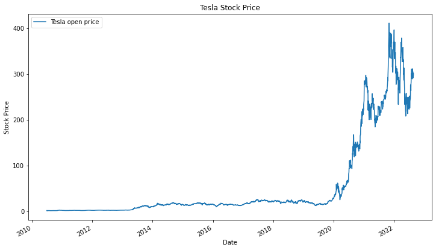

## Ford Stock

``` python
# importing Ford stock .csv

ford_stock = pd.read_csv("/Users/mac/Desktop/Desktop/Car Stock Analysis/F.csv")
```

``` python
# Checking and fixing data types

ford_stock.dtypes

ford_stock['Date'] = ford_stock['Date'].astype('datetime64')
```

``` python
# Setting Date as index

ford_stock = ford_stock.set_index('Date')
```

``` python
ford_stock
```

<div>

```{=html}
<style scoped>
    .dataframe tbody tr th:only-of-type {
        vertical-align: middle;
    }

    .dataframe tbody tr th {
        vertical-align: top;
    }

    .dataframe thead th {
        text-align: right;
    }
</style>
```
+------------+-------+-----------+-------+-------+-----------+-----------+
|            | Open  | High      | Low   | Close | Adj Close | Volume    |
+============+=======+===========+=======+=======+===========+===========+
| Date       |       |           |       |       |           |           |
+------------+-------+-----------+-------+-------+-----------+-----------+
| 2010-01-04 | 10.17 | 10.280000 | 10.05 | 10.28 | 6.784906  | 60855800  |
+------------+-------+-----------+-------+-------+-----------+-----------+
| 2010-01-05 | 10.45 | 11.240000 | 10.40 | 10.96 | 7.233713  | 215620200 |
+------------+-------+-----------+-------+-------+-----------+-----------+
| 2010-01-06 | 11.21 | 11.460000 | 11.13 | 11.37 | 7.504319  | 200070600 |
+------------+-------+-----------+-------+-------+-----------+-----------+
| 2010-01-07 | 11.46 | 11.690000 | 11.32 | 11.66 | 7.695721  | 130201700 |
+------------+-------+-----------+-------+-------+-----------+-----------+
| 2010-01-08 | 11.67 | 11.740000 | 11.46 | 11.69 | 7.715520  | 130463000 |
+------------+-------+-----------+-------+-------+-----------+-----------+
| \...       | \...  | \...      | \...  | \...  | \...      | \...      |
+------------+-------+-----------+-------+-------+-----------+-----------+
| 2022-08-22 | 15.08 | 15.210000 | 14.91 | 15.08 | 15.080000 | 71321800  |
+------------+-------+-----------+-------+-------+-----------+-----------+
| 2022-08-23 | 15.09 | 15.420000 | 15.09 | 15.32 | 15.320000 | 51289000  |
+------------+-------+-----------+-------+-------+-----------+-----------+
| 2022-08-24 | 15.32 | 15.660000 | 15.24 | 15.52 | 15.520000 | 39508700  |
+------------+-------+-----------+-------+-------+-----------+-----------+
| 2022-08-25 | 15.60 | 16.040001 | 15.58 | 15.93 | 15.930000 | 56401300  |
+------------+-------+-----------+-------+-------+-----------+-----------+
| 2022-08-26 | 16.01 | 16.090000 | 15.41 | 15.41 | 15.410000 | 54357700  |
+------------+-------+-----------+-------+-------+-----------+-----------+

<p>3185 rows × 6 columns</p>

</div>

``` python
# Ford stock graph

ford_stock['Open'].plot(label = 'Ford Open Price', figsize=(12,7))
plt.legend()
plt.title('Ford Stock Price')
plt.ylabel('Stock Price')
ford_stock['MA50'] = ford_stock['Open'].rolling(50).mean()
ford_stock['MA50'].plot()
plt.legend()
```

    <matplotlib.legend.Legend at 0x7fee5094f0a0>

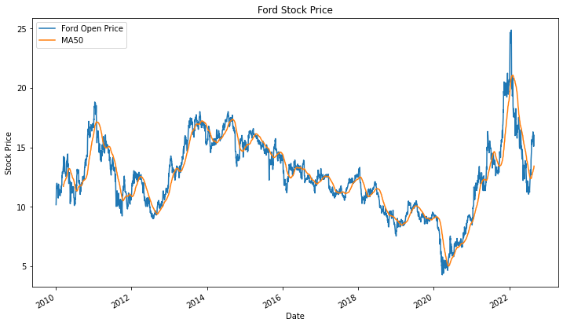

## GM Stock

``` python
# Importing GM stock .csv

GM_stock = pd.read_csv("/Users/mac/Desktop/Desktop/Car Stock Analysis/GM.csv")
```

``` python
# Checking and fixing data types

GM_stock.dtypes

GM_stock['Date'] = GM_stock['Date'].astype('datetime64')
```

``` python
# Setting Date as index

GM_stock = GM_stock.set_index('Date')
```

``` python
GM_stock
```

<div>

```{=html}
<style scoped>
    .dataframe tbody tr th:only-of-type {
        vertical-align: middle;
    }

    .dataframe tbody tr th {
        vertical-align: top;
    }

    .dataframe thead th {
        text-align: right;
    }
</style>
```
+------------+-----------+-----------+-----------+-----------+-----------+-----------+
|            | Open      | High      | Low       | Close     | Adj Close | Volume    |
+============+===========+===========+===========+===========+===========+===========+
| Date       |           |           |           |           |           |           |
+------------+-----------+-----------+-----------+-----------+-----------+-----------+
| 2010-11-18 | 35.000000 | 35.990002 | 33.889999 | 34.189999 | 26.425234 | 457044300 |
+------------+-----------+-----------+-----------+-----------+-----------+-----------+
| 2010-11-19 | 34.150002 | 34.500000 | 33.110001 | 34.259998 | 26.479338 | 107842000 |
+------------+-----------+-----------+-----------+-----------+-----------+-----------+
| 2010-11-22 | 34.200001 | 34.480000 | 33.810001 | 34.080002 | 26.340214 | 36650600  |
+------------+-----------+-----------+-----------+-----------+-----------+-----------+
| 2010-11-23 | 33.950001 | 33.990002 | 33.189999 | 33.250000 | 25.698719 | 31170200  |
+------------+-----------+-----------+-----------+-----------+-----------+-----------+
| 2010-11-24 | 33.730000 | 33.799999 | 33.220001 | 33.480000 | 25.876484 | 26138000  |
+------------+-----------+-----------+-----------+-----------+-----------+-----------+
| \...       | \...      | \...      | \...      | \...      | \...      | \...      |
+------------+-----------+-----------+-----------+-----------+-----------+-----------+
| 2022-08-22 | 38.240002 | 38.820000 | 37.919998 | 38.549999 | 38.549999 | 20921400  |
+------------+-----------+-----------+-----------+-----------+-----------+-----------+
| 2022-08-23 | 38.959999 | 39.410000 | 38.419998 | 38.560001 | 38.560001 | 15394400  |
+------------+-----------+-----------+-----------+-----------+-----------+-----------+
| 2022-08-24 | 38.610001 | 39.730000 | 38.320000 | 39.250000 | 39.250000 | 12710300  |
+------------+-----------+-----------+-----------+-----------+-----------+-----------+
| 2022-08-25 | 39.360001 | 40.779999 | 39.340000 | 40.389999 | 40.389999 | 15211900  |
+------------+-----------+-----------+-----------+-----------+-----------+-----------+
| 2022-08-26 | 40.750000 | 41.090000 | 39.220001 | 39.230000 | 39.230000 | 16174600  |
+------------+-----------+-----------+-----------+-----------+-----------+-----------+

<p>2963 rows × 6 columns</p>

</div>

``` python
# GM stock graph

GM_stock['MA50'] = GM_stock['Open'].rolling(50).mean()
GM_stock['Open'].plot(label = 'GM Open Price', figsize=(12,7))
GM_stock['MA50'].plot()
plt.legend()
plt.title('GM Stock Price')
plt.ylabel('Stock price')
```

    Text(0, 0.5, 'Stock price')

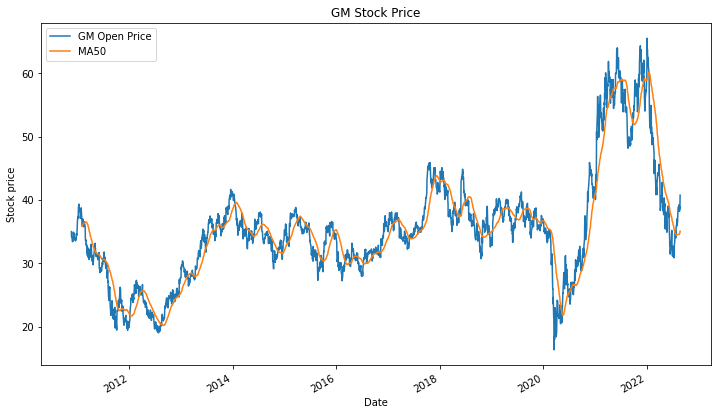

# Stock Volume Graph

``` python
# Plotting all three stocks volume together

tesla_stock['Volume'].plot(label = 'Tesla', figsize=(13,7))
ford_stock['Volume'].plot(label = 'Ford')
GM_stock['Volume'].plot(label = 'GM')
plt.legend()
plt.title('Stock Volume for GM, Ford and Tesla')
plt.ylabel('Stock volume')
```

    Text(0, 0.5, 'Stock volume')

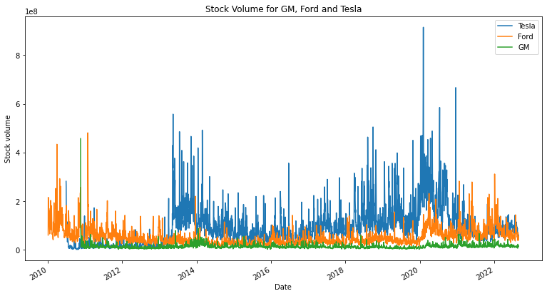

``` python
#  Highest spike in volume for tesla 

tesla_stock.iloc[[tesla_stock['Volume'].argmax()]]
```

<div>

```{=html}
<style scoped>
    .dataframe tbody tr th:only-of-type {
        vertical-align: middle;
    }

    .dataframe tbody tr th {
        vertical-align: top;
    }

    .dataframe thead th {
        text-align: right;
    }
</style>
```
|            | Open      | High      | Low       | Close     | Adj Close | Volume    |
|------------|-----------|-----------|-----------|-----------|-----------|-----------|
| Date       |           |           |           |           |           |           |
| 2020-02-04 | 58.863998 | 64.599327 | 55.591999 | 59.137333 | 59.137333 | 914081370 |

</div>

``` python
# Price relating to the spike in volume within same time frame in tesla stock

tesla_stock.iloc[2400:2500]['Open'].plot(label = 'Tesla price', figsize=(12,7))
plt.legend()
plt.title('Tesla price Feb - June 2020')
```

    Text(0.5, 1.0, 'Tesla price Feb - June 2020')

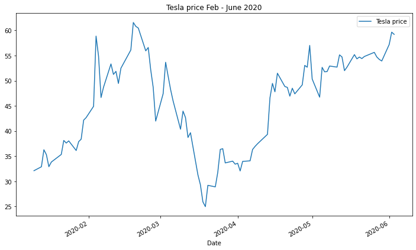

## Total amount traded for each stock

``` python
# Calculating Total Money traded by Tesla

tesla_stock['Total traded'] = tesla_stock['Open'] * tesla_stock['Volume']
```

``` python
# Calculating Total Money traded by Ford

ford_stock['Total traded'] = ford_stock['Open'] * ford_stock['Volume']
```

``` python
# Calculating Total Money traded by GM

GM_stock['Total traded'] = GM_stock['Open'] * GM_stock['Volume']
```

``` python
# Plotting all three stocks total amount traded

tesla_stock['Total traded'].plot(label = 'Tesla', figsize=(13,7))
ford_stock['Total traded'].plot(label = 'Ford')
GM_stock['Total traded'].plot(label = 'GM')
plt.legend()
plt.title('Total amount traded for GM, Ford and Tesla')
plt.ylabel('Stock volume')
```

    Text(0, 0.5, 'Stock volume')

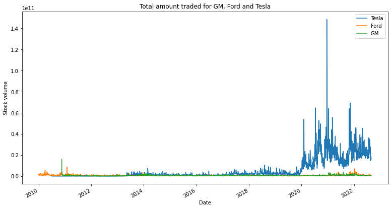

``` python
# Highest amount traded by tesla

tesla_stock.iloc[[tesla_stock['Total traded'].argmax()]]
```

<div>

```{=html}
<style scoped>
    .dataframe tbody tr th:only-of-type {
        vertical-align: middle;
    }

    .dataframe tbody tr th {
        vertical-align: top;
    }

    .dataframe thead th {
        text-align: right;
    }
</style>
```
|            | Open      | High       | Low        | Close      | Adj Close  | Volume    | Total traded |
|------------|-----------|------------|------------|------------|------------|-----------|--------------|
| Date       |           |            |            |            |            |           |              |
| 2020-12-18 | 222.96666 | 231.666672 | 209.513336 | 231.666672 | 231.666672 | 666378582 | 1.485802e+11 |

</div>

## Scatter plot

``` python
# Scatter plot visualization

from pandas.plotting import scatter_matrix
```

``` python
car_comp = pd.concat([tesla_stock['Open'], ford_stock['Open'], GM_stock['Open']], axis=1)
car_comp.columns = ['Tesla Open', 'Ford Open', 'GM Open']
```

``` python
scatter_matrix(car_comp, figsize=(13,8), hist_kwds={'bins':50})
```

    array([[<AxesSubplot:xlabel='Tesla Open', ylabel='Tesla Open'>,
            <AxesSubplot:xlabel='Ford Open', ylabel='Tesla Open'>,
            <AxesSubplot:xlabel='GM Open', ylabel='Tesla Open'>],
           [<AxesSubplot:xlabel='Tesla Open', ylabel='Ford Open'>,
            <AxesSubplot:xlabel='Ford Open', ylabel='Ford Open'>,
            <AxesSubplot:xlabel='GM Open', ylabel='Ford Open'>],
           [<AxesSubplot:xlabel='Tesla Open', ylabel='GM Open'>,
            <AxesSubplot:xlabel='Ford Open', ylabel='GM Open'>,
            <AxesSubplot:xlabel='GM Open', ylabel='GM Open'>]], dtype=object)

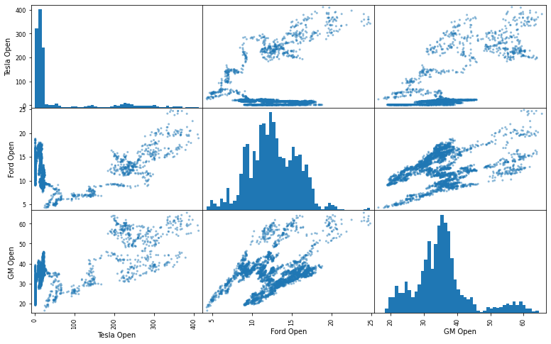

## Tesla 2022 candle stick

``` python
tesla_reset = tesla_stock.loc['2022-06-01':'2022-08-28']
```

``` python
# find the rows that are bullish

tesla_up = tesla_reset[tesla_reset.Close >= tesla_reset.Open]

# find the rows that are bearish

tesla_down = tesla_reset[tesla_reset.Close < tesla_reset.Open]
```

``` python
# Plotting Tesla stock for values in the current year 2022 as Candle stick

import matplotlib.pyplot as plt

width  = 0.9   # width of real body
width2 = 0.05  # width of shadow

fig, ax = plt.subplots(figsize=(14,9))


# plot the bullish candle stick

ax.bar(tesla_up.index, tesla_up.Close - tesla_up.Open, width, 
       bottom = tesla_up.Open, edgecolor='g', color='green')
ax.bar(tesla_up.index, tesla_up.High - tesla_up.Close, width2, 
       bottom = tesla_up.Close, edgecolor='g', color='green')
ax.bar(tesla_up.index, tesla_up.Low - tesla_up.Open, width2, 
       bottom = tesla_up.Open, edgecolor='g', color='green')

# plot the bearish candle stick

ax.bar(tesla_down.index, tesla_down.Close - tesla_down.Open, width, 
       bottom = tesla_down.Open, edgecolor='r', color='red')
ax.bar(tesla_down.index, tesla_down.High - tesla_down.Open, width2, 
       bottom = tesla_down.Open, edgecolor='r', color='red')
ax.bar(tesla_down.index, tesla_down.Low - tesla_down.Close, width2, 
       bottom = tesla_down.Close, edgecolor='r', color='red')
ax.grid(color='gray')

plt.style.use("default")
```

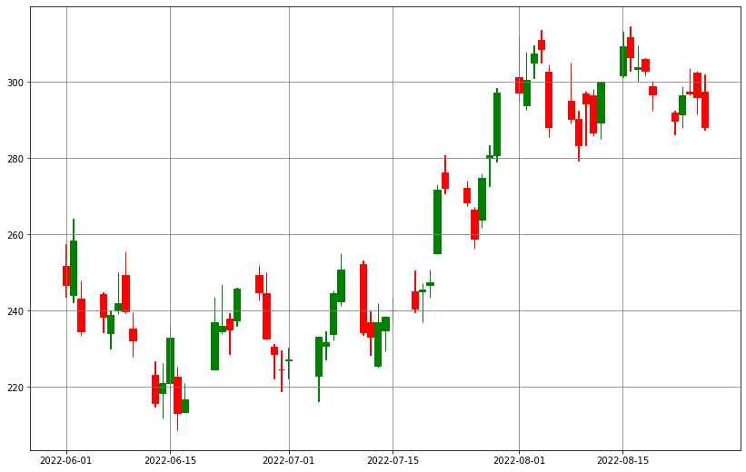

# Daily percentage change - Stock stability

``` python
# Calculating all three stock daily returns

tesla_stock['returns'] = (tesla_stock['Close']/tesla_stock['Close'].shift(1)) - 1

ford_stock['returns'] = (ford_stock['Close']/ford_stock['Close'].shift(1)) - 1

GM_stock['returns'] = (GM_stock['Close']/GM_stock['Close'].shift(1)) - 1
```

``` python
tesla_stock['returns'].hist(bins=100, label = 'Tesla', alpha=0.5)
ford_stock['returns'].hist(bins=100, label = 'Ford', alpha=0.5)
GM_stock['returns'].hist(bins=100, label = 'GM', alpha=0.5)
plt.legend()
```

    <matplotlib.legend.Legend at 0x7fee546ffd60>

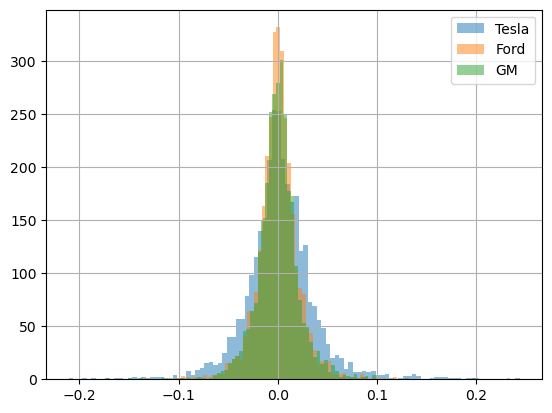

``` python
tesla_stock['returns'].plot(kind='kde', label='Tesla',figsize=(13,6))
ford_stock['returns'].plot(kind='kde', label='Ford')
GM_stock['returns'].plot(kind='kde', label='GM')
plt.legend()
```

    <matplotlib.legend.Legend at 0x7fee545e52e0>

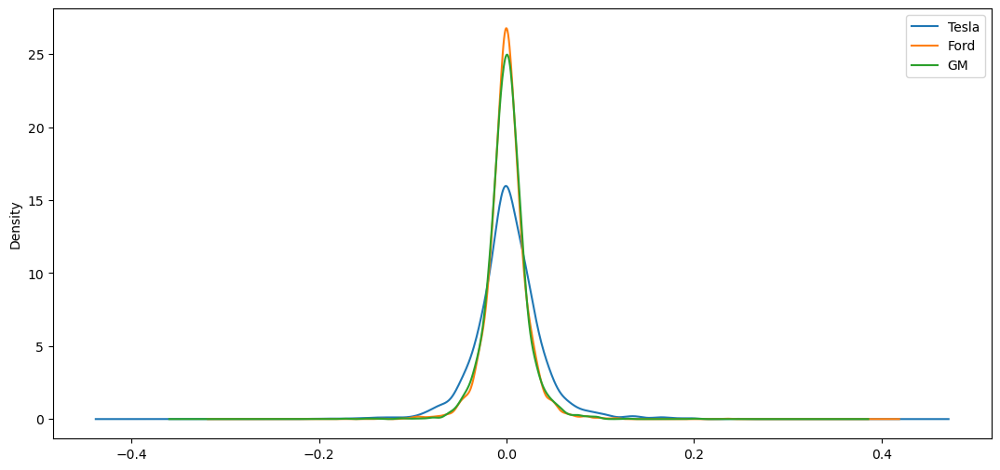

``` python
box_df = pd.concat([tesla_stock['returns'], ford_stock['returns'], GM_stock['returns']], axis = 1)
box_df.columns = ['Tesla returns', 'Ford returns', 'GM returns']
box_df.plot(kind='box', figsize=(10,6))
```

    <AxesSubplot:>

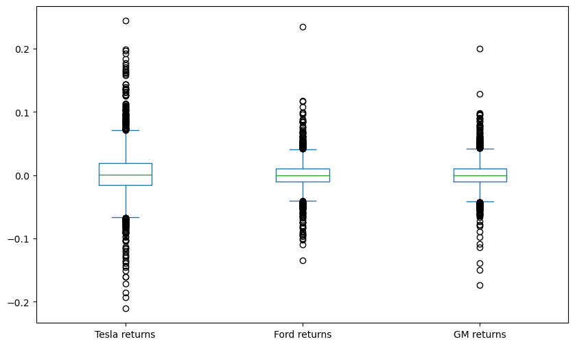

``` python
scatter_matrix(box_df, alpha=0.25, hist_kwds={'bins':50})
```

    array([[<AxesSubplot:xlabel='Tesla returns', ylabel='Tesla returns'>,
            <AxesSubplot:xlabel='Ford returns', ylabel='Tesla returns'>,
            <AxesSubplot:xlabel='GM returns', ylabel='Tesla returns'>],
           [<AxesSubplot:xlabel='Tesla returns', ylabel='Ford returns'>,
            <AxesSubplot:xlabel='Ford returns', ylabel='Ford returns'>,
            <AxesSubplot:xlabel='GM returns', ylabel='Ford returns'>],
           [<AxesSubplot:xlabel='Tesla returns', ylabel='GM returns'>,
            <AxesSubplot:xlabel='Ford returns', ylabel='GM returns'>,
            <AxesSubplot:xlabel='GM returns', ylabel='GM returns'>]],
          dtype=object)

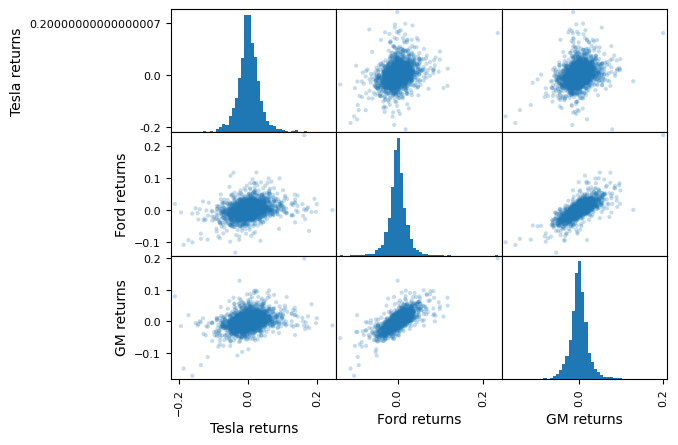

# Cumulative Returns

``` python
# Calculating the cumulative returns for the stocks.

tesla_stock['Cumulative returns'] = (1 + tesla_stock['returns']).cumprod()

ford_stock['Cumulative returns'] = (1 + ford_stock['returns']).cumprod()

GM_stock['Cumulative returns'] = (1 + GM_stock['returns']).cumprod()
```

``` python
# Plotting the Cumulative returns

tesla_stock['Cumulative returns'].plot(label = 'Tesla', figsize=(13,7))
ford_stock['Cumulative returns'].plot(label = 'Ford')
GM_stock['Cumulative returns'].plot(label = 'GM')
plt.title('Cumulative returns for (Tesla, Ford and GM) VS Time')
plt.legend()
```

    <matplotlib.legend.Legend at 0x7fee58174490>

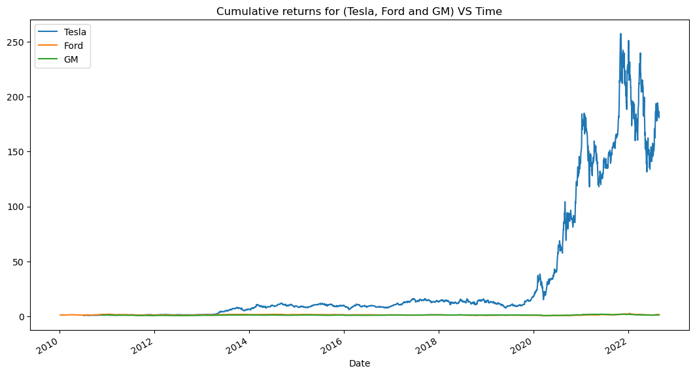

#### Tesla clearly gives the highest return on the stock investment in the early years over time

#### Tesla had the highest spike in volume in early 2020 which resulted to a fall in Open stock price of the following month and also having its highest amount traded for the decade.
